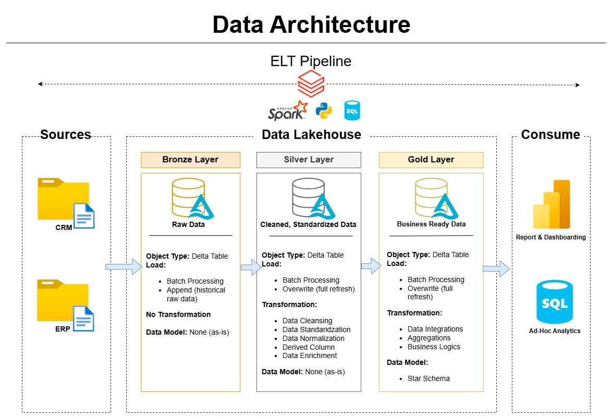
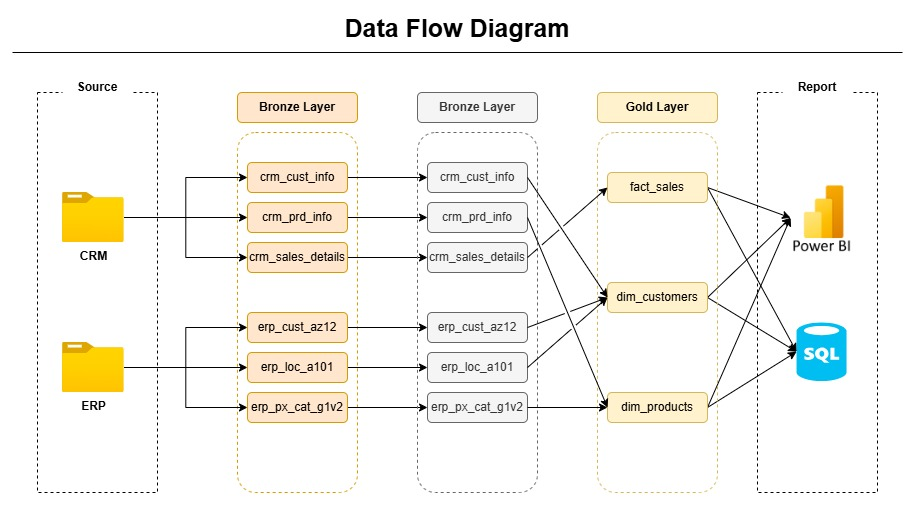
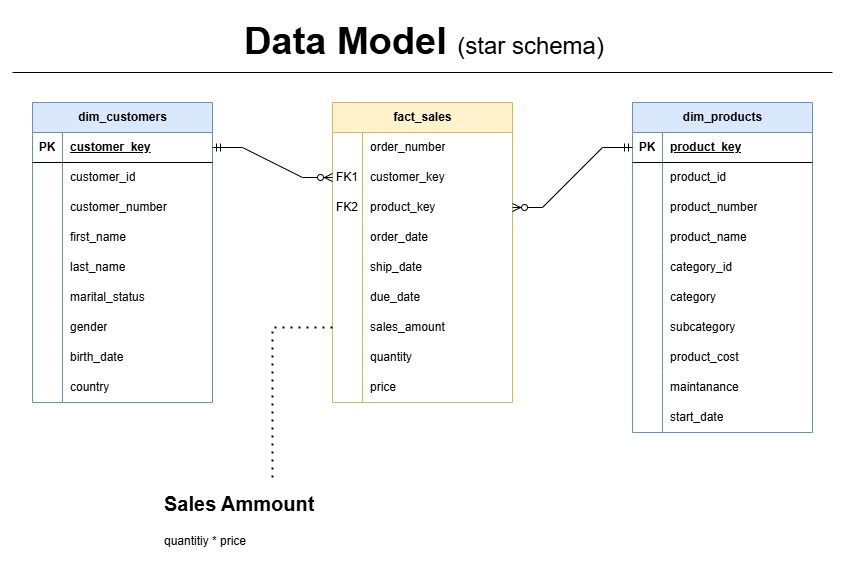
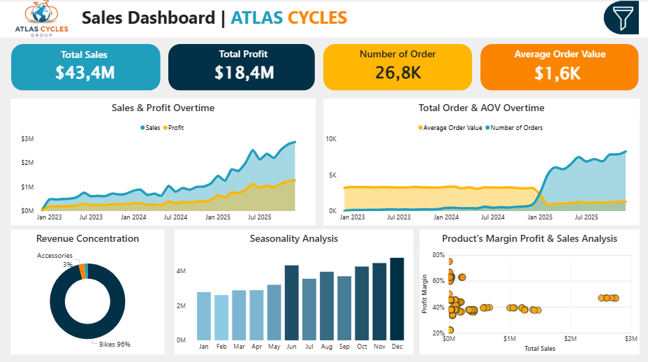

# **End-to-End Enterprise Lakehouse Architecture: Implementing Medallion ELT for Decision-Ready Analytics**

# **📖 Executive Summary**

This project demonstrates an end-to-end Lakehouse architecture integrating CRM and ERP systems into a unified analytics platform.

I designed and implemented a Medallion Architecture (Bronze–Silver–Gold) using Databricks and Delta Lake, transforming raw operational data into a dimensional star schema optimized for business intelligence consumption in Power BI.

The project covers the full data lifecycle:

- Multi-source data ingestion (CRM & ERP)

- ELT transformation using Spark & SQL

- Dimensional modeling (Fact & Dimensions)

- Business metric engineering

- BI-ready Gold layer

- Dashboard consumption layer

This simulates an enterprise-grade data platform rather than a dashboard-only project.

---

# **🏢 Business Context**

Sales data was fragmented across two operational systems:

- CRM → Customer, product, and transactional sales details

- ERP → Product categories, customer demographics, location data

There was no unified analytical model to support:

- Revenue analysis

- Customer segmentation

- Product performance monitoring

- Executive reporting

The objective was to design a scalable Lakehouse architecture that integrates both systems and delivers analytics-ready datasets, and deliver insights about what happened and what to do to enhance the company performance.

---

# **🛠 Technology Stack**

This project leverages modern data engineering and analytics tools aligned with industry standards.

### **Data Platform**

- Databricks – Lakehouse platform for distributed data processing

- Delta Lake – ACID-compliant storage layer

- Unity Catalog – Data governance and structured object management

### **Processing & Transformation**

- Apache Spark (PySpark) – ELT processing engine

- Python – Base coding language, automation and orchestration

- SQL – Data modeling and transformation logic

### **Data Modeling & Analytics**

- Dimensional Modeling (Star Schema)

- Power BI – Business intelligence & visualization

### **Version Control**

- GitHub – Repository and documentation management

This stack reflects real-world enterprise data architecture patterns.

# **📂 Dataset Overview**

The project integrates structured datasets from two operational systems:

### **CRM System**

Tables ingested:

- `crm_sales_details`

- `crm_cust_info`

- `crm_prd_info`

Contains:

- Order transactions

- Customer master data

- Product master data

- Sales amount, quantity, pricing

- Order lifecycle dates

Grain:

- One row per order line item

### **ERP System**

Tables ingested:

- `erp_cust_az12`

- `erp_loc_a101`

- `erp_px_cat_g1v2`

Contains:

- Product categories & hierarchy

- Customer demographics

- Location attributes

- Enrichment data

# **🏗 Architecture Overview**

The solution follows a Medallion (Bronze–Silver–Gold) architecture.

**Pipeline Flow:** \
Sources → Bronze (Raw) → Silver (Cleaned & Standardized) → Gold (Business Ready Star Schema) → Power BI

**Key Components**

- Databricks (Lakehouse platform)

- Apache Spark (ELT processing)

- Delta Lake (ACID storage)

- Unity Catalog (governance)

- SQL & PySpark transformations

- Python (automation and orchestration)

- Power BI (analytics layer)

## **🥉 Bronze Layer – Raw Ingestion**

**Objective:** Preserve source system integrity.

- Raw data ingested from CRM and ERP

- Append strategy (historical preservation)

- No transformations applied

- Stored as Delta Tables

- Schema maintained as-is

This layer ensures auditability and data lineage traceability.

## **🥈 Silver Layer – Cleansed & Standardized**

**Objective:** Improve data quality and consistency.

Transformations applied:

- Data cleansing

- Standardized column naming

- Derived columns

- Data normalization

- Basic enrichment

- Join validation between CRM & ERP entities

Still stored in Delta format for reliability and performance.

## **🥇 Gold Layer – Business Ready Model**

**Objective:** Deliver analytics-optimized datasets.

Implemented a dimensional star schema:

#### **Fact Table**

`fact_sales`

- Grain: One row per order line

- Metrics:

  - sales_amount = quantity × price

  - quantity

  - price

#### **Dimension Tables**

`dim_customers`

- Customer attributes

- Demographic enrichment

- Country

`dim_products`

- Product hierarchy

- Category & subcategory

- Cost

- Maintenance flag

- Start date

The Gold layer serves as the single source of truth for analytics and reporting.

---

# **📊 Data Modeling Approach**

The model follows dimensional modeling best practices:

- Star schema design

- Surrogate keys

- Clearly defined grain

- Separation of facts and dimensions

- Business metric logic centralized in Gold layer

This structure optimizes query performance and simplifies BI consumption.

---

# **⚙️ Engineering Decisions & Trade-offs**
1. **ELT over ETL**

    Transformations executed inside the Lakehouse using Spark to leverage distributed compute power.

2. **Delta Lake Format**

    Selected for:

    - ACID compliance

    - Reliability

    - Performance optimization

    - Scalability

3. **Full Refresh in Gold**

    Ensures metric consistency and avoids partial aggregation errors.

4. **Star Schema over Snowflake**

    Chosen to:

    - Simplify analytical queries

    - Improve BI performance

    - Reduce model complexity

5. **Power BI Import Mode**

    Selected to:

    - Improve dashboard performance

    - Avoid live cluster dependency

    - Optimize local BI responsiveness

---

# **📈 Analytics Layer (Power BI)**

The Gold layer is consumed in Power BI to validate business usability.

Dashboard Features:

- Total Sales

- Total Profit

- Number of Orders

- Average Order Value (AOV)

- Sales & Profit trend analysis

- Revenue concentration

- Seasonality analysis

- Product margin vs sales distribution

- Multi-dimensional filtering

The dashboard confirms that the Gold model is analytics-ready and decision-support capable.

---

# **📊 Business Insights and Recomendations**

This section translates analytical findings into business-level implications and strategic actions.

### 1. Business Model Shift: From High-Value Transactions to Volume-Driven Growth
Analysis indicates a structural shift in purchasing behavior, reflected by:

- Decreasing Average Order Value (AOV)

- Significant increase in total number of orders

- Overall growth in total revenue and profit

This shift correlates with the expansion of product offerings into accessories and clothing categories, which are generally lower in price but higher in purchase frequency.

**Strategic Interpretation:**

The company is transitioning from a low-volume, high-ticket model toward a high-volume, lower-value transaction model.

**Strategic Implication:**

While AOV decline might initially appear negative, the volume expansion has strengthened total sales and profitability. This signals successful product diversification and broader market penetration.

**Strategic Recommendation:**

- Optimize operational efficiency to support higher order frequency (logistics, fulfillment, inventory turnover)

- Monitor contribution margin by product category to ensure volume growth remains profitable

- Track AOV alongside Customer Lifetime Value (CLV) to ensure long-term revenue sustainability

- This reframes AOV decline as a strategic evolution rather than a performance issue — that’s executive-level thinking. 

### 2. Revenue Concentration & Portfolio Risk Exposure

Analysis shows a significant revenue concentration within the Bikes category, contributing the majority share of total revenue.

**Strategic Risk:**

Heavy reliance on a single product category increases exposure to market volatility, supply chain disruption, and competitive pricing pressure.

**Strategic Recommendation:**

- Diversify revenue streams through accessories and complementary product lines

- Strengthen cross-selling strategies

- Monitor category-level revenue dependency as a recurring KPI

### 3. Revenue vs Profitability Misalignment

Several high-volume products demonstrate disproportionate contribution to revenue relative to profit margin.

**Strategic Risk:**

Revenue growth without margin optimization may inflate topline performance while compressing overall profitability.

**Strategic Recommendation:**

- Conduct SKU-level margin optimization analysis

- Revisit pricing strategy for high-volume low-margin products

- Introduce profitability-weighted performance metrics instead of revenue-only tracking

### 4. Geographical Revenue Concentration & Market Strategy Divergence

Revenue distribution is heavily concentrated in the United States and Australia, with significantly lower performance across other regions.

**Strategic Risk:**

High dependence on two primary markets increases exposure to localized economic downturns, regulatory changes, or competitive disruption.

Further analysis reveals distinct market behaviors:

- United States: High-volume, lower-value transaction pattern

- Australia: Low-volume, higher-value transaction pattern

This indicates differentiated purchasing behavior across regions.

**Strategic Interpretation:**

The company is effectively operating two different commercial models within its top-performing markets.

**Strategic Recommendation:**

- Develop region-specific growth strategies rather than applying a unified global approach

- In the US, focus on operational scalability and retention mechanics

- In Australia, emphasize premium positioning and margin optimization

- Evaluate expansion opportunities in underperforming regions to reduce geographic concentration risk

### 5. Seasonal Demand Pattern & Operational Alignment

Sales trends indicate recurring seasonal demand fluctuations.

**Strategic Risk:**

Without proactive planning, seasonality can create inventory inefficiencies and reactive operational decision-making.

**Strategic Recommendation:**

- Align inventory planning with forecasted seasonal peaks

- Adjust marketing budget allocation based on demand cycles

- Integrate demand forecasting models into the analytics layer

---

# **🎯 Key Skills Demonstrated**

#### **Data Engineering**

- Lakehouse architecture

- Medallion implementation

- Spark & SQL transformations

- Star schema modelling

- Python automation and orchestration

- Delta Lake

- Data integration

- Governance via Unity Catalog

#### **Analytics Engineering**

- Dimensional modeling

- Business metric engineering

- Fact & dimension design

- BI optimization

- Analytical dataset preparation

#### **Data Analyst**

- Data transformation and cleaning

- Report and dashboarding

- BI analysis

- Ad-hoc analysis

- Data storytelling

---

# 🏁 Conclusion

This project demonstrates the ability to:

- Design scalable data architecture

- Integrate multiple source systems

- Transform raw data into structured analytical models

- Deliver business-ready datasets for reporting

- Drive actionable business insights to enhance company performance

It reflects both Data Engineering, Analytics Engineering, and Data Analyst competencies within a single end-to-end implementation.